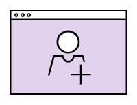

PWC Follow App</a>

<a href='https://follow.szuhy.xyz'/>👉 Goto App</a>

 

## Features

- 👉 User Login and User Follow API
- 🧙‍♂️ E2E Typesafety with tRPC
- 🔐 E2E testing with Cypress
- 🛠 FullStack React with Next.js
- 📱 Responsive Design with Tailwind
- 📚 Database with Prisma and PostgreSQL
- 🚢 Docker It!
- 💡 Inspired by [Create T3 App](https://create.t3.gg/)
